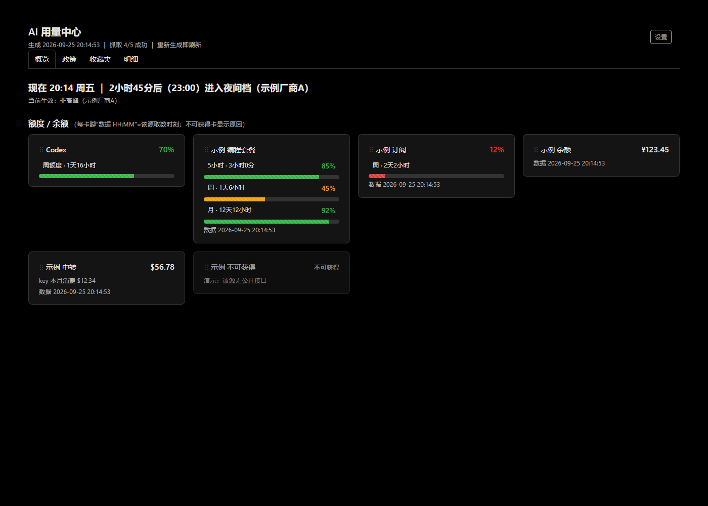
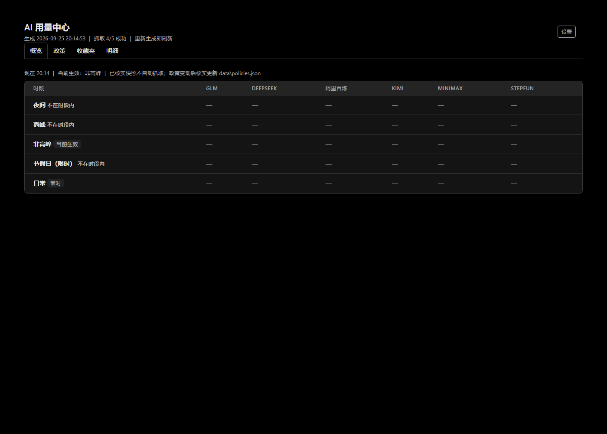
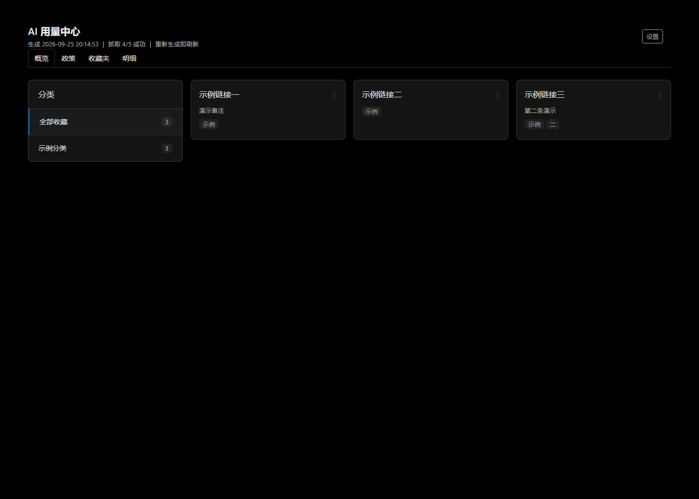
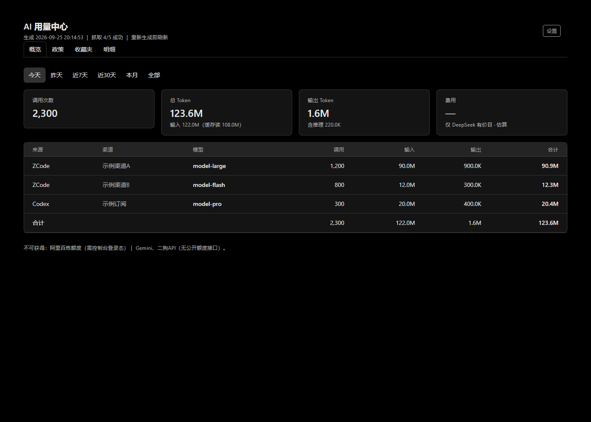
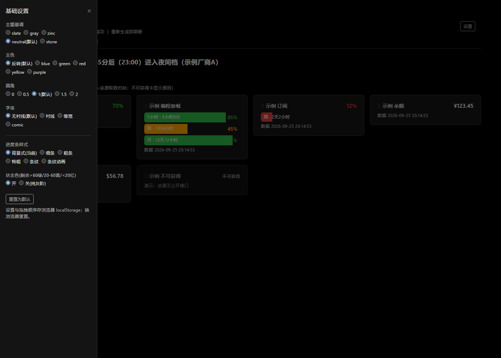
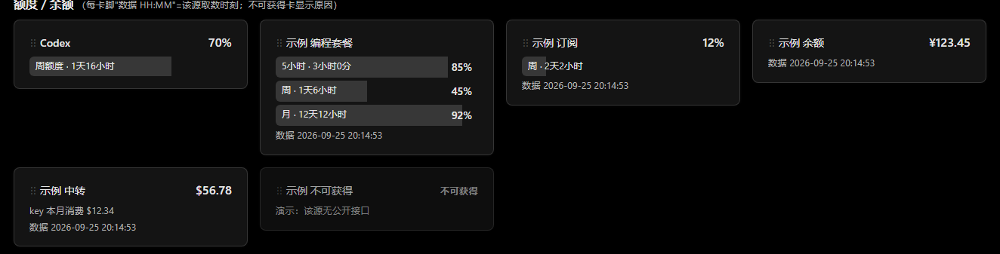
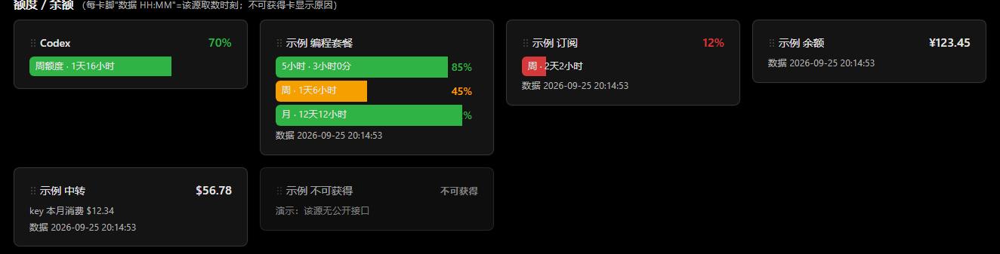
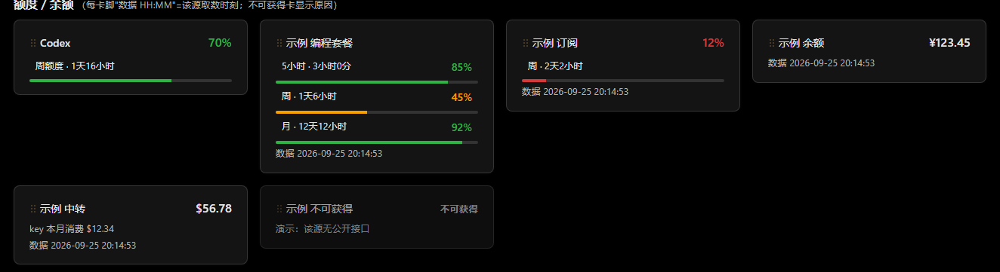
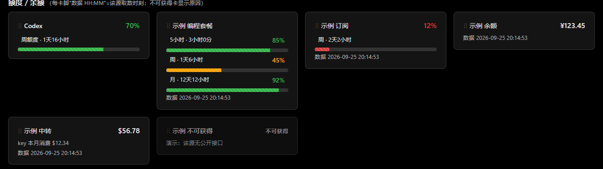
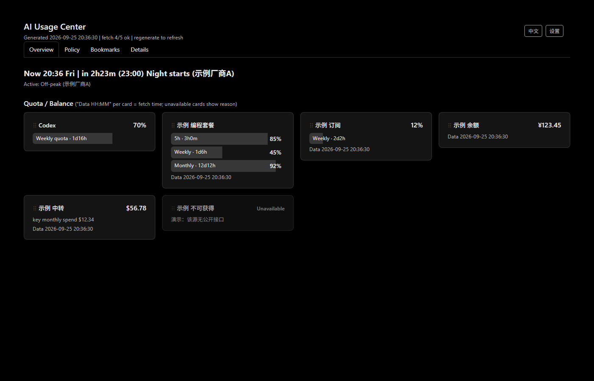

# AI 用量看板（ai-usage-dashboard）

一台电脑、多个 AI CLI 工具、多家模型订阅——用量和额度终于在一页看清。

**单文件 Python（纯标准库，零 pip 依赖、零驻留进程、零端口、零中间数据库）**：双击 `start.bat`（或 `py scripts\usage_dashboard.py`）→ 只读扫描本地数据 → 调各家官方额度接口 → 生成一个自包含静态页 `dashboard\index.html` 并自动打开。跑完即退。

## 能看到什么

| 区域 | 内容 | 数据源（全部只读） |
|---|---|---|
| 用量统计 | 调用次数 / 输入·输出·缓存·推理 token / 按渠道×模型分布，六个时间段（今天/昨天/近7天/近30天/本月/全部） | ZCode 本地库 `~/.zcode/cli/db/db.sqlite` + Codex 会话文件 `~/.codex/sessions`（UTC 已换算本地日界，response_id 去重） |
| 额度/余额 | GLM（z.ai key 版 + BigModel 控制台版双套餐）、阿里百炼（Coding Plan + Token Plan）、Kimi（5小时/7天/订阅合计三指标）、MiniMax、DeepSeek、StepFun、智谱钱包、new-api 系中转站（key 维度剩余+消费） | 各家官方额度接口；控制台登录态型（阿里/智谱/Kimi）经会话捕获 |
| 政策情报 | 一张矩阵表：日常/高峰/非高峰/夜间/节假日 × 各厂商，当前生效的行实时标亮 ●；每条带来源+核实日期 | 人工核实快照（`data/policies.json`），不自动抓取、不拿估算冒充 |

设计原则：**数据真实高于一切**——每个数字可回溯到原始来源；拿不到的如实标"不可获得"；费用只有明确价目才估算并标注。

## 界面与样式画廊（均为假数据 demo 截图，不含真实账户信息）

四个页签：

| 概览 | 政策 | 收藏夹 | 明细 |
|---|---|---|---|
|  |  |  |  |

设置面板（主题/主色/圆角/字体/进度条样式/状态色）：



进度条样式 × 状态色（设置面板可切换，默认=背景式+状态色关）：

| 背景式·色关(默认) | 背景式·色开 | 细条 | 粗条 |
|---|---|---|---|
|  |  |  |  |
| **特粗** | **条纹** | **条纹动画** | |
|  |  |  | |

中英双语：右上角 EN/中文 按钮切换（界面 chrome 双语，存 localStorage）：



## 快速开始

```
要求：Windows + Python 3.10+（本机已在用 ZCode / Codex 则数据源自动发现）
1. py scripts\usage_dashboard.py        # 生成并打开看板
2. py scripts\console_quota.py --login ali   # 可选：控制台会话型额度（阿里/智谱/Kimi 同理，扫码一次）
3. 双击 start.bat 即日常使用
```

- ZCode 的 provider 凭据自动发现（按 templateId / baseUrl 匹配，见 `scripts/usage_dashboard.py` 的 `_quota_job_registry`），**API key 只在运行时内存中使用，绝不写入本项目任何文件、日志或页面**。
- 可用环境变量覆盖数据源位置：`ZCODE_HOME`、`CODEX_HOME`。

## 配置（全部可选）

| 文件 | 作用 |
|---|---|
| `data/prices.json` | 估算价目（默认 DeepSeek 官方 USD 价 + 可编辑汇率；所有金额页面标"估算"） |
| `data/custom_providers.json` | **加一个 new-api 系中转站 = 加一段 JSON，零代码**（剩余配额+本月消费） |
| `data/policies.json` | 政策矩阵：每条带 band（日常/高峰/非高峰/夜间/节假日）+ active_rule（时段规则），看板按当前时间实时判"生效中" |
| `data/extra_keys.json` | 手动凭据模板（各控制台 Cookie / web token / 站点账号），留空=不启用 |

## 添加新数据源的规则（决策树）

1. **用量统计**：零配置——经 ZCode / Codex 调用的模型自动进表；
2. **额度卡四选一**：官方有 key 接口 → 加一个适配器函数（约 20 行）；new-api 系中转 → 加一段 JSON；只认控制台登录态 → `console_quota.py` 的 TARGETS 加目标 + 一个 parse 函数，扫码一次后无头刷新；没有接口 → 如实标"不可获得"；
3. **政策** → 核实后往 `policies.json` 加一条（不录未核实内容）。

## 已知机制与坑（源码内均有实测注释）

- ZCode 源库对 `model_usage` 按 ~1 万行滚动修剪 → 看板按天聚合留存（`data/zcode_daily.json`）防丢；隔多日不运行可能丢最老的天（可注册每日计划任务 `--install-task`）；
- 控制台会话型（阿里/智谱/Kimi）：登录 cookie 为会话级 → `--login` 登录生效瞬间导出会话，`--fetch` 无头复用；服务器会话过期时该卡如实提示重扫；
- Cloudflare 会拦自动化浏览器：中转站钱包维度提供了 Cookie 粘贴通道（`extra_keys` 的 `<id>_cookie`）；
- 捕获黑名单：控制台回明文 key 的接口（如 ApiKeysPlain）一律不解析不落盘。

## 安全

凭据（API key / 控制台会话）只运行时内存使用；会话文件（`data/*_cookies.json`、`*_profile/`）等同登录凭据、仅本地、可删；输出页面与缓存只含归一化数字。请自行注意这些文件的磁盘访问权限。

## 许可

MIT（见 LICENSE）。页面样式用 [Tabler](https://github.com/tabler/tabler)（MIT，经 CDN 引入）；本项目不捆绑任何私有主题文件。
